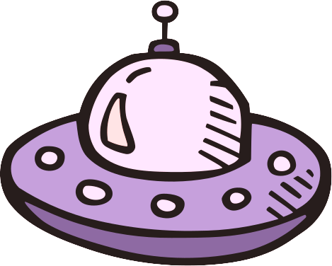

# Alien Invasion
__Alien Invasion__ is a well-known game where the player must shoot down a fleet of alien ships.

The game is based on a task 14-6 from Eric Mathis's [book](https://disk.yandex.ru/i/ttWTX-bEfT5LrQ) "Learning Python. Game programming, data visualization, web applications"

The goal of this game is to enhance practical programming abilities in Python.

## Gameplay

After starting the game, we are greeted by the main menu screen, with the option to start the game, view its rules and leave it
 
When you click on the Start Game button, we go directly into battle.
The gameplay involves the player shooting at alien ships, while the aliens return fire.

To make the game not boring, I added various game elements and mechanisms to it:

- A variety of game objects;   
- Transitions to a new level;
- Unique features of game objects;
- Scoring and keeping the record;
- Sound effects;
- Some graphical improvements.

Let's consider each item separately!

### A variety of game objects
All game elements that affect the gameplay can be divided into two categories: ships and shells. These elements are different for the player and the aliens, which gives the game a special dynamic.

---
#### Ships
The player has the opportunity to play on 3 ships, each of which is better after destroying the previous one. Thus, the player has 3 attempts in one game. 
 Let's look at each of them:

| Image | Description                                                  |
|-------|--------------------------------------------------------------|
||The player's standard ship, equipped with one gun.|
||An improved ship with two side guns that fire simultaneously.|
||The most powerful ship with three guns and a special projectile for one of them.|

The player's ships can be destroyed in the following situations:

1.  when they are hit by alien bullets;

2.  as a result of a collision with aliens;

3. when the alien fleet reaches the bottom of the screen.
---
Alien ships have three types:

| Image | Description                                                  |
|-------|--------------------------------------------------------------|
||A standard alien ship. It is destroyed immediately after being hit by a player's bullet.|
||A boosted alien ship. It is destroyed after several hits by the player's bullet.|
||A system of hit points is provided for the armored ship. If a player hits it with a bullet,  the ship is not completely destroyed, but gets damaged |

Each of them is capable of firing identical projectiles at the player.

---
#### Projectiles
Usually, the player shoots ordinary bullets that can destroy one alien. However, when he has a third ship at his
disposal, he will receive a new gun with a special type of red projectile. This projectile is capable of shooting 
through all the aliens it hits.

In addition, a new type of weapon has been added to the game — an aerial bomb, available to all ships. 

It can be used if
the player decides to bypass the alien fleet and attack them from above. Each aerial bomb is capable of destroying a 
group of aliens. If it hits an armored alien, it will immediately destroy it, otherwise it will cause damage to it.

--- 
Alien ships, in turn, have one type of projectile that is equally fatal even with a single hit on the player. However,
the aliens periodically fire projectiles in random order, which guarantees return fire at the player until he completely
destroys them.

---

### Transitions to a new level
When you move to a new level of the game, the difficulty increases. Here's how it happens:

1. All game objects such as bullets, projectiles and ships become faster. 
2. The number of aliens who can shoot at you and have armor increases. 

If the player's ship collides with the last alien, then the hit counts and the player moves to the next level, but loses
the ship.

___

### Scoring and keeping the record
In this game, points are awarded for each successful shot by the player at an alien ship or projectile. Not only direct
hits are taken into account, but also shots fired with boosted bullets and aerial bombs.

The higher the level of the game, the more points are awarded for each hit.
However, if the alien fleet reaches the bottom edge of the screen, the player loses the ship and remains at the same
level, and all points gained disappear.

