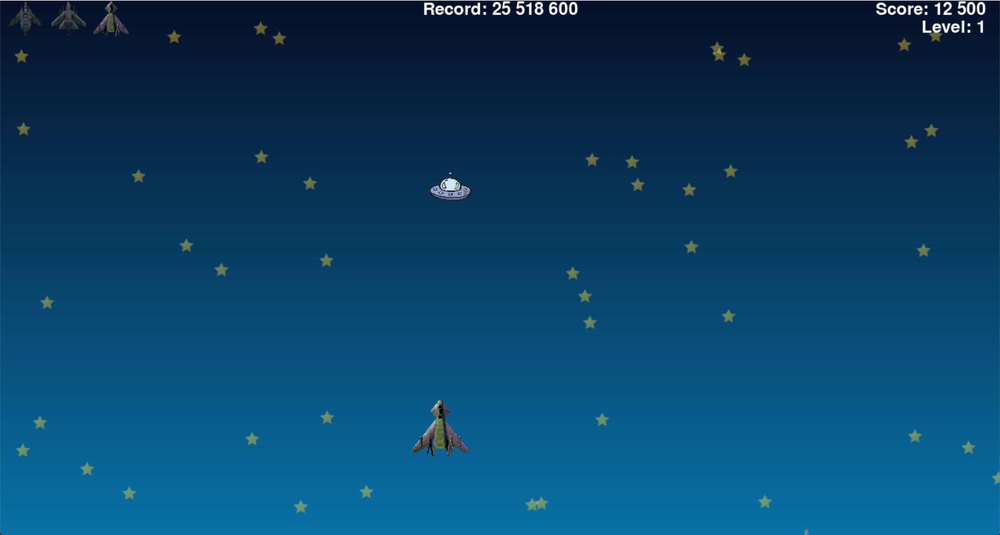
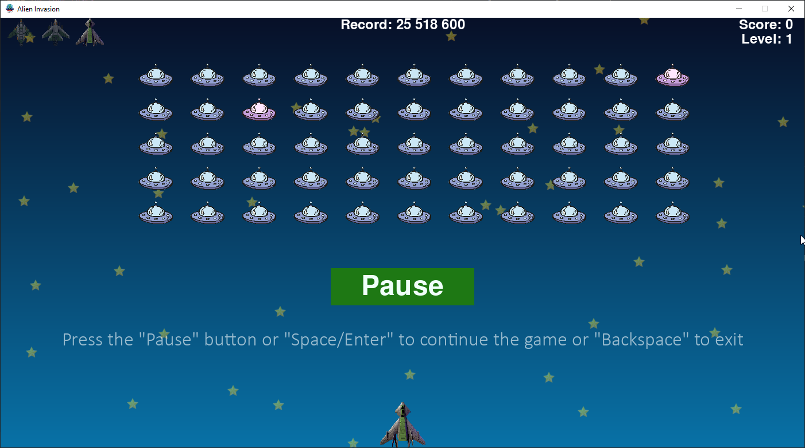

# Alien Invasion

__Alien Invasion__ is a well-known game where the player must shoot down a fleet of alien ships.

The game is based on a task 14-6 from Eric Mathis's [book](https://disk.yandex.ru/i/ttWTX-bEfT5LrQ) "Learning Python. Game programming, data visualization, web applications"

The goal of this game is to enhance practical programming abilities in Python.

# Gameplay

After starting the game, we are greeted by the main menu screen, with the option to start the game, view its rules and leave it
 
When you click on the Start Game button, we go directly into battle.
The gameplay involves the player shooting at alien ships, while the aliens return fire.


## Key Features

To make the game not boring, I added various game elements and mechanisms to it:

- A variety of game objects;   
- Transitions to a new level;
- Scoring and keeping the record;
- Sound effects;
- Some graphical effects.

Let's consider each item separately!

### Game ships

All game elements that affect the gameplay can be divided into two categories: **ships** and **shells**. These elements are different for the player and the aliens, which gives the game a special dynamic.


The player has the opportunity to play on 3 ships, each of which is better after destroying the previous one. Thus, the player has 3 attempts in one game. 
 Let's look at each of them:

| Image | Description                                                  |
|-------|--------------------------------------------------------------|
||The player's standard ship, equipped with one gun.|
||An improved ship with two side guns that fire simultaneously.|
||The most powerful ship with three guns and a special projectile for one of them.|

The player's ships can be destroyed in the following situations:

1.  when they are hit by alien bullets;

2.  as a result of a collision with aliens;

3. when the alien fleet reaches the bottom of the screen.

### Alien ships
In turn, alien ships have three types:

| Image | Description                                                  |
|-------|--------------------------------------------------------------|
||A standard alien ship. It is destroyed immediately after being hit by a player's bullet.|
||A boosted alien ship. It is destroyed after several hits by the player's bullet.|
||A system of hit points is provided for the armored ship. If a player hits it with a bullet,<br/> the ship is not completely destroyed, but gets damaged |


Each of them is capable of firing identical projectiles at the player.


### Players projectiles

Usually, the player shoots ordinary bullets that can destroy one alien. However, when he has a third ship at his
disposal, he will receive a new gun with a special type of red projectile. This projectile is capable of shooting 
through all the aliens it hits.

| Image                                                                                     | Description                                    |
|-------------------------------------------------------------------------------------------|------------------------------------------------|
|  | A standard projectile destroys one alien       |
|   | Boosted projectile hits the entire alien fleet |


In addition, a new type of weapon has been added to the game — an **aerial bomb**, available to all ships. 

| Image                                                                              |Description|
|------------------------------------------------------------------------------------|--|
|  |An aerial bomb falls from above and destroys a group of aliens |

It can be used if
the player decides to bypass the alien fleet and attack them from above. Each aerial bomb is capable of destroying a 
group of aliens. If it hits an armored alien, it will immediately destroy it, otherwise it will cause damage to it.


### Alien projectiles
Alien ships, in turn, have one type of projectile that is equally fatal even with a single hit on the player. However,
the aliens periodically fire projectiles in random order, which guarantees return fire at the player until he completely
destroys them.

| Image                                                                                  |Description|
|----------------------------------------------------------------------------------------|--|
|  |The alien's projectile destroys the player's ship with a single hit  |


### Transitions to a new level

The transition to a new level occurs after the player destroys the alien fleet. 
When you move to a new level of the game, the difficulty increases. Here's how it happens:

1. All game objects such as bullets, projectiles and ships become faster. 
2. The number of aliens who can shoot at you and have armor increases. 

#### The edge cases:
- if the player's ship collides with the last alien, then the hit counts and the player moves to the next level, but loses
the ship;



- if the alien fleet reaches the bottom edge of the screen, the player loses the ship and remains at the same level.


### Scoring and keeping the record

In this game, points are awarded for each successful shot by the player at an alien ship or projectile. Not only direct
hits are taken into account, but also shots fired with boosted bullets and aerial bombs. The record of the game is
always displayed at the top of the window and saved in the .txt file of the project.

The higher the level of the game, the more points are awarded for each hit.
#### The edge cases 

- if the alien fleet reaches the bottom edge of the screen, the all points gained disappear.

## Control in different game states

| State        | Screenshot | Key                                 | Description                                                                                             |
|--------------|----|-------------------------------------|---------------------------------------------------------------------------------------------------------|
| Main menu    |    | Enter<br/>Esc<br/>F1<br/>           | *The beginning of the game<br/>Exiting the game<br/>Viewing the rules of the game*                      |
| Game process || Space<br/>P<br/>Shift<br/>Esc       | *Shooting at aliens<br/>Pause the game<br/>Dropping an aerial bomb<br/>Exiting the game without saving* |
| Pause        || Enter/P/Space<br/>Backspace<br/>Esc | *Exit the pause and continue the game<br/>Return to the main menu<br/>Exiting the game without saving*  |
| About it     || Backspace<br/>Esc                   | *Return to the main menu  <br/> Exiting the game*                                                       |


## Description of some mechanics
Here I would like to talk in more detail about some interesting mechanics that, in my opinion, make the game more fun.
Some of these mechanics were invented by me to complicate the gameplay. Each description of the mechanics is accompanied
by an example of a piece of code that implements it.

### Using randomness

This mechanic has been added to increase the unpredictability of the behavior of the following game elements:
- the location of the stars in the sky (changes after each restart of the game);
```python
    star.x = randint(0, star.rect.width * 3) + randint(100, 250) * star_number
    star.rect.x = star.x

    star.y = randint(0, star.rect.height * 4) + randint(130, 200) * row_number
    star.rect.y = star.y
```
- selection of boosted alien ships (changes with each level);
```python
    index_boosted_aliens = random.sample(range(number_aliens_x*number_rows_aliens), count_boosted_aliens)
```
- selection of shooting alien ships (changes cyclically every N seconds).
```python
    shooting_aliens = random.sample(aliens.sprites(), num_shooting_aliens)
```

### The explosion of an air bomb in a certain radius
To find out how many aliens were in the radius of the bomb explosion, a formula is used to calculate the distance
between two points: the center of the bomb at the time of the explosion and the centers of all surviving aliens.

The formula looks like this:


```python
distance = math.sqrt((alien_center_x - explosion_center_x) ** 2 + (alien_center_y - explosion_center_y) ** 2)
        if distance < ai_settings.air_bomb_radius_explosion:
            destroyed_aliens.append(alien)
```

### Building an alien fleet
The formation of an alien fleet resembles the process of creating stars in the sky. However, unlike them, the 
coordinates of the location of the ships are clearly defined and do not depend on chance.

```python
    alien.x = alien_width / 2 + 1.5 * alien_width * alien_number
    alien.rect.x = alien.x
    
    alien.y = alien_height/2 + 1.5 * alien_height * row_number
    alien.rect.y = alien.y
```

### Hit points of the boosted alien
In the game, alien ships of a certain color can be destroyed after several bullet hits or air bombs exploding next to
them, except for a direct hit by an air bomb.  Thus, these aliens have a certain level of protection (the parameter can
be adjusted), so they are called "boosted".

``` python
    def hit(self, ai_settings):
        """Processing hits on an boosted alien"""
        self.hits_count += 1
        if self.hits_count == 1:
            self.image = self.image_damaged
        # if the number of hits exceeded the allowed limit
        elif self.hits_count >= ai_settings.allowed_count_hits:
            self.kill()
```

### Background gradient
The game used the linear interpolation method, which allowed you to create smooth transitions between two colors on the
entire screen. This method finds the intermediate shades between each pair of gradient points for each color channel.

```python
def create_gradient(width, height):
    """Creating a gradient surface from two colors  """
    gradient_surface = pygame.Surface((width, height))
    # creating a gradient surface from two colors  
    start_color = (7, 16, 40)
    end_color = (9, 114, 167)
    # using linear interpolation to find an intermediate color for each row 
    for y in range(height):
        r = int(start_color[0] + (end_color[0] - start_color[0]) * (y / height))
        g = int(start_color[1] + (end_color[1] - start_color[1]) * (y / height))
        b = int(start_color[2] + (end_color[2] - start_color[2]) * (y / height))
        # filling each row of the surface with an intermediate color 
        gradient_surface.fill((r, g, b), (0, y, width, 1))
    # return of the gradient surface 
    return gradient_surface
```
### Enhanced Player's Bullet
For a change, a new, more powerful type of projectile has been added to the game. It will help the player to cope
better with fast enemies.

```python
boosted_bullets_aliens_collisions = pygame.sprite.groupcollide(boosted_bullets, aliens, False, True)
if boosted_bullets_aliens_collisions:
        count_destroyed_aliens = handle_collision(boosted_bullets_aliens_collisions, ai_settings, screen, explosions,
                                                  stats, sb, aliens)
```

### The explosion effect
In the game, the explosion of all ships is tied to their coordinates and disappears over time.

```python
 for explosion in explosions.sprites():
        if current_time - explosion.creation_time >= ai_settings.explosion_duration:
            explosion.kill()
        else:
            # calculating a variable to set the transparency effect over time
            alpha = ((pygame.time.get_ticks() - explosion.creation_time) / ai_settings.explosion_duration *
                     ai_settings.explosion_alpha)
            # setting transparency before the end of the effect display time
            explosion.image.set_alpha(255 - alpha)
```

### The effect of the shot
When the ship fires, a flame appears at the place of the shot. The flame belongs to the explosion class, is tied to a
specific ship and disappears over time as a normal explosion.  

```python
    # creating a shot effect in a given location 
    new_small_explosions = SmallExplosion(ai_settings, screen, ship, ship_type, shot_location)
```

### The effect of star movement
To create the effect of flying, randomly placed stars move in the background. After each one hits the bottom edge of
the screen, it "invisibly" moves to the top.

```python
    for star in stars.sprites():
        # when the top of the star reaches the bottom edge of the screen, the star moves up
        if star.check_edges():
            star.rect.top -= star.rect.bottom
            star.y = star.rect.top
            break
```

### The movement of the alien fleet
To make the game more dynamic, the alien fleet moves in different directions depending on the flag. When it reaches the
left or right edge of the screen, it changes its direction and at the same time descends slightly, approaching the
player.

```python
def check_fleet_edges(ai_settings, aliens):
    """Checking if the fleet reaches the edge of the screen"""
    for alien in aliens.sprites():
        if alien.check_edges():
            change_fleet_direction(ai_settings, aliens)
            break


def change_fleet_direction(ai_settings, aliens):
    """Lowers the fleet down and changes the direction of its movement"""
    for alien in aliens.sprites():
        alien.rect.y += ai_settings.fleet_drop_speed
    # changing the direction flag
    ai_settings.fleet_direction *= -1
```


## Setting up the game
At the moment, the developer has set the basic parameters of game objects and their behavior. However, the user can make
their own changes using the file **settings.py** . By opening this file, the player will be able to easily understand which
parameters remain unchanged and which change as the game level increases.

### Unchanged settings
Unchanged settings include paths to images and sounds, sizes, colors, text data, and constant speed. These parameters
are in the *Settings* class, and grouping variables by objects and their exact names helps the user to quickly navigate
and experiment with the game. For example, here's what immutable alien settings look like:
```python
        # alien parameters
        self.image_alien = 'images/alien.png'
        self.image_boosted_alien = 'images/boosted_alien.png'
        self.image_damaged_alien = 'images/damaged_alien.png'
        self.alien_width = 60
        self.alien_height = 40
        # number of strength points of the "reinforced" alien
        self.allowed_count_hits = 4
```

### Changeable settings 
The changeable settings are defined in the *initialize_dynamic_settings()* function. Here, the initial values of
parameters such as the speed of all objects, the radius of the explosion of an air bomb, points for destroying an alien,
as well as the number of improved and shooting aliens are set.
```python
    def initialize_dynamic_settings(self):
        """Initializing settings that change as the game progresses"""
        # setting the initial speed of the player's ship 
        self.ship_speed_factor = 4
        # setting the initial velocity of the player's ship's bullet 
        self.ship_bullet_speed_factor = 10
        # setting the initial velocity of an alien bullet 
        self.alien_bullet_speed_factor = 5
        # setting the initial flight speed of an aerial bomb 
        self.air_bomb_speed_factor = 7
        # explosion radius for an aerial bomb 
        self.air_bomb_radius_explosion = 100
        # setting the initial velocity of the alien ships 
        self.alien_speed_factor = 5
        # starting points for the alien  
        self.alien_points = 200
        # the initial number of "boosted" aliens 
        self.count_boosted_aliens = 2
        # the number of shooting aliens 
        self.count_shooting_aliens = 1
        # the initial flag for setting the direction (at 1 - to the right, at -1 - to the left)  
        self.fleet_direction = 1
```
As the game level increases, the *increase_speed()* function is called, which changes the values of dynamic parameters by
a specific value set by the user, or by a formula.
```python
    def increase_speed(self, stats):
        """Increasing the speed values of game objects"""
        self.ship_speed_factor *= self.speedup_scale
        self.ship_bullet_speed_factor *= self.speedup_scale
        self.alien_speed_factor *= self.speedup_scale
        self.alien_points *= self.score_scale
        self.count_boosted_aliens += 2
        self.count_shooting_aliens = (stats.level // 2) + 1
        self.air_bomb_speed_factor *= 1.1
        self.air_bomb_radius_explosion += 10
```
## Using tools

| Category                       |                    Tool                                                                     |
|-----------------------------|--------------------------------------------------------------------------------------------|
| **Programming language**    | Python 3.6                                                                                 |
| **Development environment** | PyCharm Education 2024.3                                                                   |
| **Libraries**               | pygame, random, sys, math, time, hint                                                      |
| **Musical accompaniment**   | Bfxr, Web: [Zvukipro](https://zvukipro.com/dendy/750-zvuki-iz-igry-tanchiki-na-dendi.html) |
| **Graphic**                 | ShareX, Web: [Pixabay](https://pixabay.com/ru/)                                                        |


## Feedback

To contact me, use email prihodkov21vek@gmail.com  
